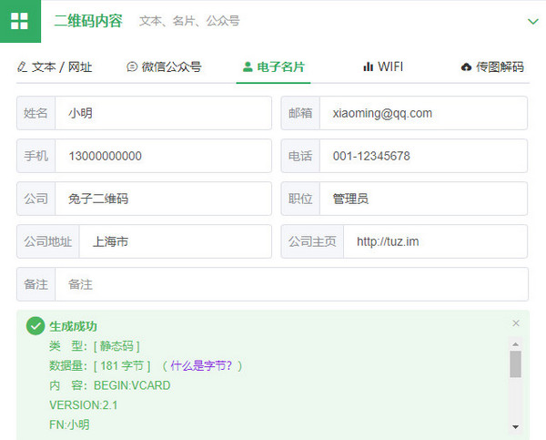
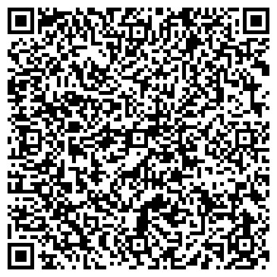

​在过去，人们拿了名片，需要手动把上面的信息存进手机。如今，智能手机已经普及，有没有什么方法可以方便地保存联系人信息呢？

## vcard电子名片

在电脑和智能手机中，有一种比较普及的电子通讯录格式：vcard。用户可以将联系人信息按照vcard格式规范制作成 .vcf 格式的文件。之后只需要将这个文件导入到手机中，就可轻松保存联系人信息，是一种非常方便的联系人迁移方式。vcard可以存储多种不同类型的信息：姓名、邮箱、手机、电话、职位、主页等，下面就是姓名为小明的 vcard 名片格式示例：

```
BEGIN:VCARD
VERSION:2.1
FN:小明
EMAIL:xiaoming@qq.com
TEL;CELL:13000000000
TEL;WORK:001-12345678
ORG:兔子二维码
TITLE:管理员
ADR;WORK:上海市
END:VCARD
```

## 什么是二维码名片

**<span style="color: #3366ff;">我们通常所说的二维码名片其本质就是vcard电子名片。</span>**有了二维码，我们不再需要制作.vcf 格式的文件，取而代之，可以将 vcard 名片信息储存在二维条形码中，用户通过扫码软件轻轻一扫，就可读取条码上的联系人信息，然后一键保存到手机通讯录中，整个过程变得轻松而又便捷！现在，我们可以借助兔子二维码可以快速生成二维码名片。

   

接下来使用微信来扫描。我们可以看到微信可以准确的识别出二维码名片所保存的联系人信息。我们可以点击保存将联系人保存到手机上。整个流程非常方便。与传统的纸质名片相比，电子名片的交换保存更加便捷，而且绿色环保、节省成本。所以在未来的智能生活或商务交流中，必将扮演一个非常重要的角色。