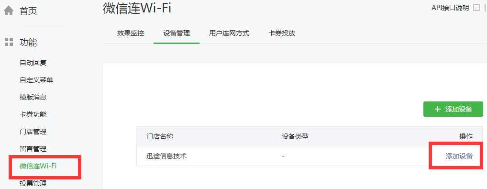
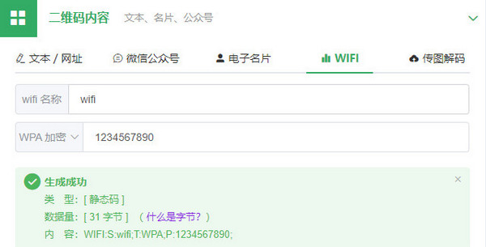
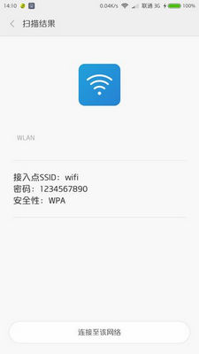

很多商家为给顾客提供更好地服务，都提供了免费的WIFI网络，可是很多时候都得逐一告诉顾客们密码，用户输入密码又非常的麻烦。如今有了二维码这种方便获取信息的工具，商家可以把WiFi信息制作成二维码，顾客自己用手机一扫即可自动连接无线网络了。今天就带大家了解一下扫码连接WiFi的技术。

## 微信连Wi-Fi

在2015年，微信公众平台新添了一个功能插件，即"微信连Wi-Fi"，微信公众号管理员可以在后台添加Wi-Fi信息，添加后顾客就可以通过微信扫码直接来连接门店的无线WIFI

第一步，首先使用微信连WIFI功能必须是认证服务号，如果已经有微信公众号没有认证的，需要登录微信公众号进行认证。

第二步，进入"微信连Wi-Fi"申请开通，已有认证过的公众号可以直接申请微信连Wi-Fi。

## 普通WiFi二维码

微信连Wi-Fi是经过微信官方认证的专用二维码，但申请过程过于繁琐。

此时可以使用安卓手机认可的普通WiFi二维码，我们只需要将WiFi信息生成二维码，用户便可以扫描连接。但它的缺点就是目前QQ、微信等软件出于安全考虑，识别这类二维码后不会主动去连接。用户只能使用手机自带的摄像头、扫一扫功能或者WiFi万能钥匙这类软件来连接网络。

现在，我们借助兔子二维码工具快速制作WiFi信息二维码，输入我们的WiFi信息。

  

接下来使用微信来扫描。我们可以看到微信只显示了WiFi信息，但并未主动连接。然后换用小米手机自带的"扫一扫"来扫描，可以看到手机识别出了WiFi信息，点击连接就可直接连接了。是不是很方便呢？

