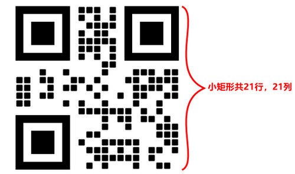

关于QrCode的一些常识，原理、容量、容错率等

## 二维码原理

二维码的基本原理是利用二进制来存储信息的。通常由正方形矩阵像素点组成。下图就是一个常见的二维码形状。它一共由21行，21列的小矩形组成。矩阵中"黑色点"表示二进制"1"， "白色点"表示二进制"0"。这些 1 和 0 排列组合就形成了二维码。

除了 1 和 0 的像素点之外，二维码还有三个像眼睛一样的大黑色块，叫做 定位点。这是二维码识别时用来对图像进行定位的，一定不能遮挡。否则将无法识别。

## 二维码尺寸（版本）

二维码一共有40个尺寸，是根据行数、列数来区分的。官方称为Version。

* Version 1（即尺寸1）是 21 x 21的矩阵（即二维码有21行，21列的小矩形组成）（下图就是一个Version 1的二维码）
 

* Version 2（即尺寸1）是 25 x 25的矩阵
* ...
* Version 40（即尺寸40）是177 x 177 的矩阵。

二维码Version越高存储的信息越多。容量最高的是version 40、容错率为"L"的尺寸。可存储 2953 字节的数据（约2.9KB）

## 存储信息最大容量（在UTF-8编码下）

二维码可以存储多种不同的数据、字符类型。不同的字符存储容量也不同。

* UTF-8 字节数：2953 字节（约2.9KB）
* UTF-8 数字/字母数据：2953 个
* UTF-8 汉字：2953/3 = 984 个

## 二维码纠错能力（容错率）

​二维码具备很强的纠错能力，即使它被遮挡了一部分，也能被设备正常识别。利用这一特点，我们经常在二维码中间加上Logo，并不影响它的读取和识别。

容错率就是来衡量二维码纠错能力的参数，不同的纠错等级对应了不同的容错率。

* L级：容错率7%，可被遮挡7%，表示即使条码被遮挡7%，也能被正常识别。
* M级：容错率15%，可被遮挡15%
* Q级：容错率25%，可被遮挡25%
* H级：容错率30%，可被遮挡30%

## 二维码结构

* 尺寸（Version）信息：QrCode共有40种尺寸的矩阵，从21×21（Version 1），到177×177（规格40）
* 格式信息：表示二维码的纠错级别，分为L、M、Q、H
* 数据和纠错码字：实际保存的二维码信息，和纠错码字（用于修正二维码损坏带来的错误）
* 定位点、定时标志、校正图形：用于对二维码的定位，确定二维码的内容区域
