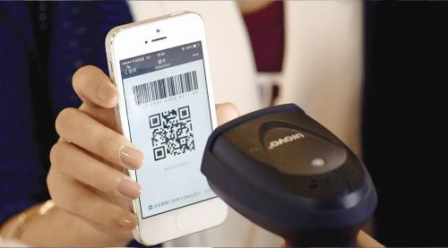

如今互联网支付已经成为人们日常消费的主要支付方式。二维码作为一种重要的移动互联网工具，也逐步被应用到支付领域发展成为一种新兴的电子支付方式：二维码支付。

## 什么是二维码支付？

二维码支付是一种实时交易付款的移动支付方式。它的支付的方式有两种：正扫（用户扫描商家的二维码）和反扫（商家扫描用户的手机二维码）。

**正扫：**商家将用户购买的商品订单信息生成二维码，用户使用支付宝等支付工具扫描这个二维码，输入密码完成支付结算，最终完成交易。正扫与我们平时现金购物流程是相同的。

**反扫：**用户将自己支付工具账户内的付款二维码提供给商家，商户扫码用户的二维码实现扣款。反扫相当于银行卡的刷卡过程。

## 二维码支付优缺点

正扫和反扫这两种支付方式均存在我们的日常生活中，两者虽然均可以实现付款，但其差别是很大的。有各自的优缺点。

正扫只需商家提供一张二维码就能实现收款，商家大大降低了成本费用。缺点在于消费者还需要输入金额、密码才能够实现支付，略微繁琐。同时商家要防范被犯罪分子利用，如果二维码被人偷换，会造成很大的麻烦。

反扫则可以实现免密支付，用户只需出示自己二维码便可完成支付。缺点在于商家需要配备扫描枪，并且入驻支付宝成为商户，需要付出更多的硬件成本。同时消费者要防范被犯罪分子利用，如果"付款码"泄露，会造成财产损失。

防骗提醒：有些犯罪分子会利用有些人对"收款码"与"付款码"的概念混淆实施诈骗。作为用户一定要保管好自己的"付款码"，"收款码"，不要随意泄露给别人，以免造成财产损失。

