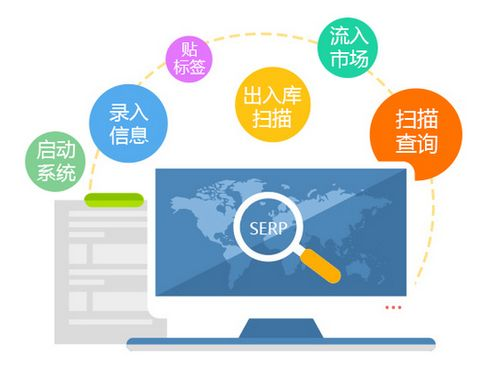

二维码最初目的是在汽车制造厂用来追踪零件，在很长时间里它的用途也仅局限于产品追踪、物品识别、存货管理等。直到智能手机普及，才被广泛应用并出现在我们的日常生活中。今天就介绍一下二维条形码在产品追踪、管理方面的用途。

## 产品溯源

二维码溯源是指厂家在生产产品时将产品信息(如产地、生产批次、生产日期、产品去向等信息)生成二维码并印刷在产品包装上，商品流向市场后，消费者只需通过手机扫码，即可获知该产品的基本信息，从而实现产品信息的追踪，也就是所谓的产品溯源。

溯源的主要目的是防范假冒伪劣产品，解决产品安全问题。消费者通过扫码可以查询商品来源信息，即使商品出现质量问题，也可及时追溯到产品来源，找到相关责任人。但二维码是可以伪造的，所以产品还必须要具备防伪功能，才能有效地防范假冒伪劣产品。

## 二维码防伪

二维码只是一张储存信息的图片，极其容易复制，所以它本身是没有防伪功能的。现阶段，市场上流行的溯源、防伪系统大都采用"一物一码"技术，并通过二维码与云端信息结合的方法(也就是活码)实现溯源与防伪的功能。

"一物一码"即每件产品都有一个唯一的防伪码。厂家不仅需要把防伪码对应的加密二维码印刷到产品包装，还要将其对应的商品信息录入数据库。消费者通过扫码即可查询产品的来源信息和真伪，同时系统会记录下产品被扫描的次数、时间、地点等信息。由于二维码的唯一性，伪造的难度和成本会大大增加。而且根据二维码扫描次数等信息可以判断产品是否涉嫌伪造，比传统查询真伪的方式更加可靠。

当前，二维码溯源与防伪系统已经受到行业的广泛认可并应用到我们日常购买的商品当中。与传统的产品管理方案相比，它管理更方便、效率更高，具备广阔的市场前景！