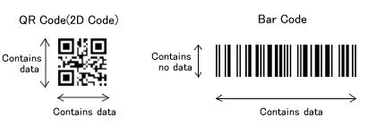
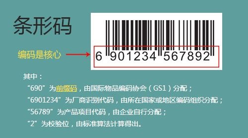

二维码与一维条形码是我们生活中最常见的两种条码，在智能设备未普及之前，条码市场是一维条形码的天下，我们可以在每一件商品包装上都能看到一维条形码的存在。但随着二维码在各行各业的普及，它的影响力逐渐超过了一维条形码，那么二者有什么区别呢？

## 二维码 VS 一维条形码

**一维条形码**是通过黑白相间的平行线条来存储信息的，通常条纹下还会有英文字母或阿拉伯数字。它只在水平方向表达信息，而在垂直方向不表达任何信息，固定的高度则是为了便于扫码设备对准。

* 最大信息容量：30个字符左右。
* 支持字符类型：只能包含字母和数字。
* 无纠错能力：条码遭到损坏后便无法识别。

**二维码**通常是方形矩阵，通过黑、白像素在矩阵中的不同分布来储存信息。在水平和垂直方向都表达信息。

* 支持字符类型和最大信息容量：数字型数据：7,089个；字母型数据：4,296个；8位字节类数据：2,953个；汉字数据：1,817个。
* 纠错能力：L,M,Q,H 四个纠错等级，小面积破损后依然能够识别。

## 发展前景

二维码是在一维条形码的基础上的发展而来，它各方面能力是优于一维条形码的，但一维码技术更加成熟，在世界上已经形成了统一的使用标准，而且它的许多优点仍然是二维码无法替代的。

1. 一维码读取设备简单，硬件成本低，读取速度快。
2. 一维码读取难度较低，适合各种恶劣的极端环境读取，比如超市。
3. 一维码下方通常有英文字母或阿拉伯数字，在读码设备读不出的时候，可以人工识别输入。
4. 很多地方完全不需要使用二维码来储存大量数据。

所以一维码目前依然能够满足市场的基本需求。同时在生产成本、识别难易度上，一维码反而更占优势，而这些往往是企业和市场所需要的。另外大规模更换条码和读码设备并不实际。短时间内二者仍会共同存在，在各自领域发挥自身的优势。