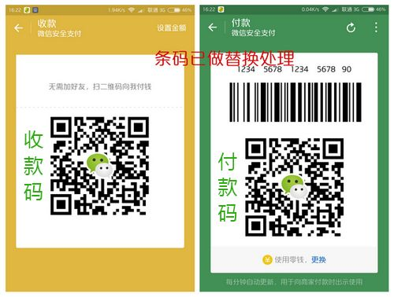
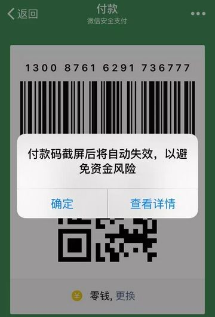

如今，无论是商场、超市，还是饭店、宾馆，几乎所有的商业场所都可以使用支付宝、微信来进行支付，扫一扫二维码就可以轻松搞定。这种扫码支付方式非常便捷、高效，受到很多商家和消费者的青睐。

## 收款码 or 付款码？傻傻分不清楚

我们在使用支付宝、微信支付时，经常会见到两种支付方式。有时是我们扫商家的二维码，有时是商家扫我们的二维码...这两者到底有什么区别呢？

* 收款码：属性是二维码，特点是长期不变，别人无需加你好友，扫该二维码就可以向你付款；
* 付款码：属性是由一个条形码和一个二维码组成，特点是每分钟都会更新，用途是：用商家专用的设备扫一扫，支付就完成了，相当于使用POS机刷卡，是你向别人付款。

"收款码""付款码"都是由别人来扫描你的二维码，但前者是别人向你账户付款，后者是商家扣取你账户的钱款。而且在小额支付时，别人扫描你的"付款码"进行扣款时，是不需要密码的！这种"小额免密码扣款"的设定本身是为了方便支付，但它却极易被一些骗子利用。

## 谨防"付款码"骗术

骗子经常会利用各种手段骗取用户的"付款码"，由于有些用户对"付款码"了解甚少，便轻易交出了自己的"付款码"截图，骗子扫描后，利用小额支付便可"盗走"用户的财产。虽然"付款码"每分钟自动更新，但只要骗子在短时间内得到"付款码"，仍然能够达到盗窃的目的。

为了防止此类诈骗，微信与支付宝都进行了相应的改进。例如：微信版本6.3.23之后，使用IOS手机进行截屏，"付款码"就会失效。但为了安全起见，还是建议大家手机、微信、支付宝都要设置手势密码，这样即使手机落入他人之手，你的账户财产也很难被盗取。
    

