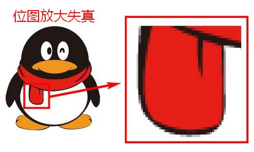

**矢量二维码就是可以无限放大而且不会失真（即不会变模糊）的二维码图像。**矢量图是与位图相对应的一种图像格式。

## 矢量图与位图

计算机中有两种基本的图像类型，位图和矢量图。

**位图**是由许许多多像素点组成的，每个像素点都包含有图片的色彩、明度等信息。这类图像可以呈现复杂的图像，所以在网络上很常见，常见的格式有JPG、PNG、GIF等，可以通过PhotoShop来制作。它的缺点是放大时会失真，图像变得模糊、有锯齿。    如图，我们可以看到位图放大后变成了一个个小方格，这些小方格就叫做像素，是位图图像的最小单位。

**矢量图**是由一系列点、线、面等元素组成的图像。它记录的是图像的轮廓和色彩等信息，适合呈现轮廓、颜色比较简单的图像。常见的格式有SVG、EPS、PDF等，大多是通过CoreIDRAW、AutoCAD、Illustrator等软件制作出来的。失量图的优点是它可以无限放大，而且永远不会失真。

## 矢量二维码用途

在设计或印刷大尺寸海报、宣传单或工程图纸时，制作人员经常需要使用大尺寸的高清图像。这个时候，矢量图就派上用场了，它可以无限放大而且不会失真，是设计、印刷的最佳选择。所以在需要印制大型二维条形码时，我们自然就要用到"矢量二维码"了，也就是可以无限放大且不会失真的二维码图像。

现在，兔子二维码已经提供了免费的"矢量二维码"生成和下载的功能，有SVG、EPS两种格式可以使用，只需点击"保存二维码"旁边的箭头，就能选择下载不同格式的矢量二维码图像了。