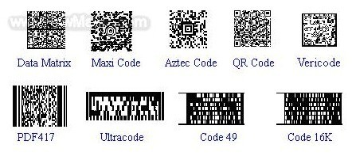

我们经常使用的微信、支付宝二维码，其实它真正的学名叫做QR Code（Quick Response Code的缩写），它是日本Denso-Wave公司在1994年发明的，由于使用比较广泛，所以我们才习惯性的称之为"二维码"。事实上，二维码是所有二维条形码的统称，它是有很多种类的，QR Code只是其中一种。

## 什么是二维码

二维码又称为二维条形码，是相对于一维条形码而言的。**二维码的基本原理是利用二进制来存储文字信息，并使用以"黑色点"表示二进制"1"， "白色点"表示二进制"0"，**从而实现信息的存储和自动读取。

二维条形码有很多种类，常用的有：QRCode，PDF417，Code49，Code16K，DataMatrix，MaxiCode，Aztec，Vericode等（下图是它们的样子）。其中最常见的是QrCode，它是日本Denso-Wave公司在1994年发明的，QR来自英文Quick Response的缩写，即疾速反应的意思。

## 二维条形码的分类

二维条形码可以分为堆叠式二维条码和矩阵式二维条码。

堆叠式二维条码，其编码原理是建立在一维条形码之上的，按需求将一维码堆积成二行或多行。它在编码设计、校验道理、识读方法等方面也承继了一维条形码的一些特色。有代表性的有：Code16K、Code49、PDF417等。

矩阵式二维条码，通常由矩阵像素点组成。一般在矩阵相应元素位置用"黑色点"表示二进制"1"， 用"白色点"表示二进制"0"。点的排列组合确定了矩阵式二维条码所代表的意义。具有代表性的有：QRCode、DataMatrix、MaxiCode等。